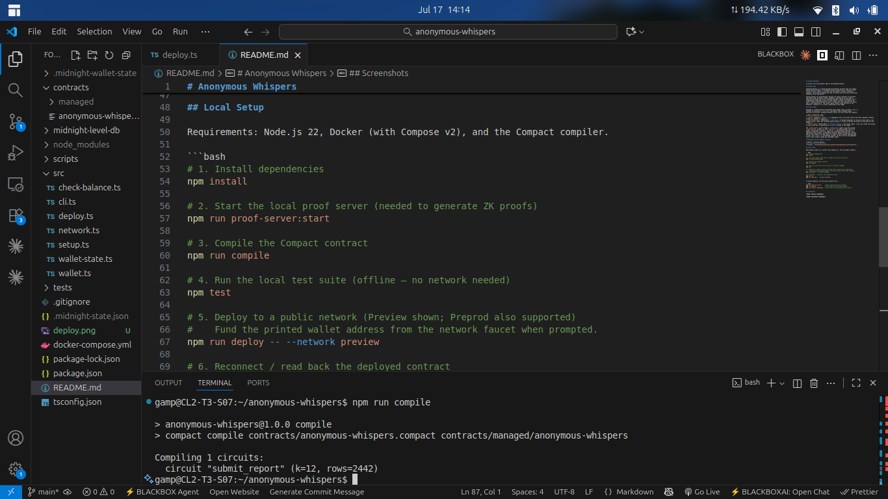
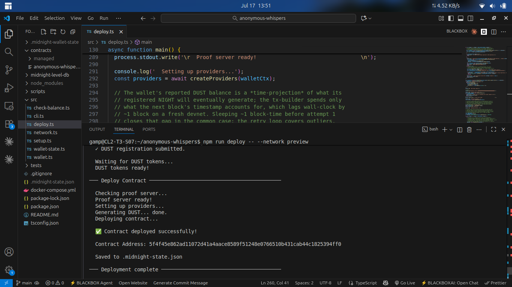

# Anonymous Whispers

A privacy-first whistleblower dApp on the Midnight Network.

## Product Idea

Anonymous Whispers is a decentralized whistleblower platform that lets people
safely publish evidence of wrongdoing without exposing their identity or the
content of their report. It is built for journalists' sources, corporate
insiders, and citizen watchdogs who need to surface the truth while protecting
themselves from retaliation.

Privacy matters for whistleblowers because the report *content* is precisely
what makes them vulnerable: names, documents, and details can be used to
identify and punish the source. Anonymous Whispers therefore publishes only a
cryptographic commitment (a hash) to each report on-chain. The network can
prove "a report was submitted at time T" without ever learning what the report
says or who submitted it. The actual report content stays entirely on the
whisperer's machine, it is never transmitted to the ledger.

## Privacy Model

Midnight is a data-protection blockchain where ledger state is either **public**
(visible to everyone) or **private** (encrypted, never revealed unless
explicitly disclosed). Anonymous Whispers splits its state along that boundary:

| State | Visibility | Why |
|-------|-----------|-----|
| `counter` (Counter) | **Public** | An aggregate count of how many reports have been submitted. Reveals volume, not content or identity. |
| `latest_report_hash` (Bytes\<32\>) | **Public** | A SHA-256 commitment to the most recent report. Lets anyone verify a report was recorded without seeing it. A hash is one-way and cannot be reversed into the content. |
| `report_content` (Bytes\<256\>) | **Private witness** | The actual report. Lives only inside the proving circuit on the user's machine and is **never** written to the ledger. |

The `submit_report` circuit takes a `content_hash` (public) and the private
`report_content` witness. It uses `disclose()` to safely promote **only the
hash** from private to public. `disclose()` is the boundary function: it
exposes a specific value to the ledger while leaving everything else, most
importantly the witness, encrypted and private. Because we disclose the hash
and not the content, the chain learns "a report exists" without learning what
it says. The `counter` is incremented (public) so the world can see aggregate
report counts without seeing any individual report.

## Deployed Contract Address (Preview)

| Network | Contract Address |
|---------|------------------|
| Preview | `5f4f45e862ad11072d41a4aace8589f51248e0766510b431cab44c1825394ff0` |

## Local Setup

Requirements: Node.js 22, Docker (with Compose v2), and the Compact compiler.

```bash
# 1. Install dependencies
npm install

# 2. Start the local proof server (needed to generate ZK proofs)
npm run proof-server:start

# 3. Compile the Compact contract
npm run compile

# 4. Run the local test suite (offline — no network needed)
npm test

# 5. Deploy to a public network (Preview shown; Preprod also supported)
#    Fund the printed wallet address from the network faucet when prompted.
npm run deploy -- --network preview

# 6. Reconnect / read back the deployed contract
npm run cli
npm run test:e2e -- --network preview
```

To switch networks, set the active network first:

```bash
npm run network preview      # make preview the active network
npm run network              # print the current active network
npm run network undeployed   # switch back to the bundled local devnet
```

## Screenshots




