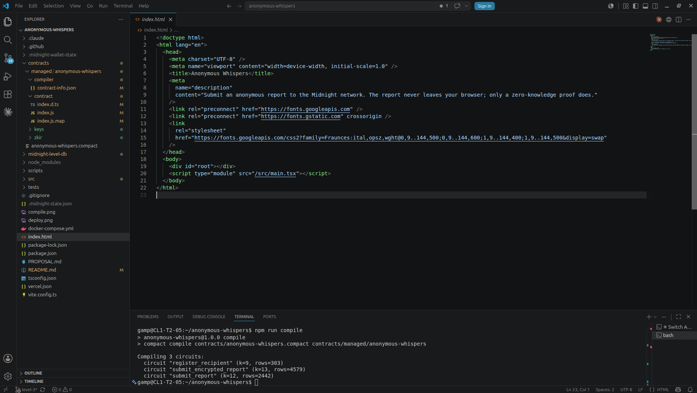
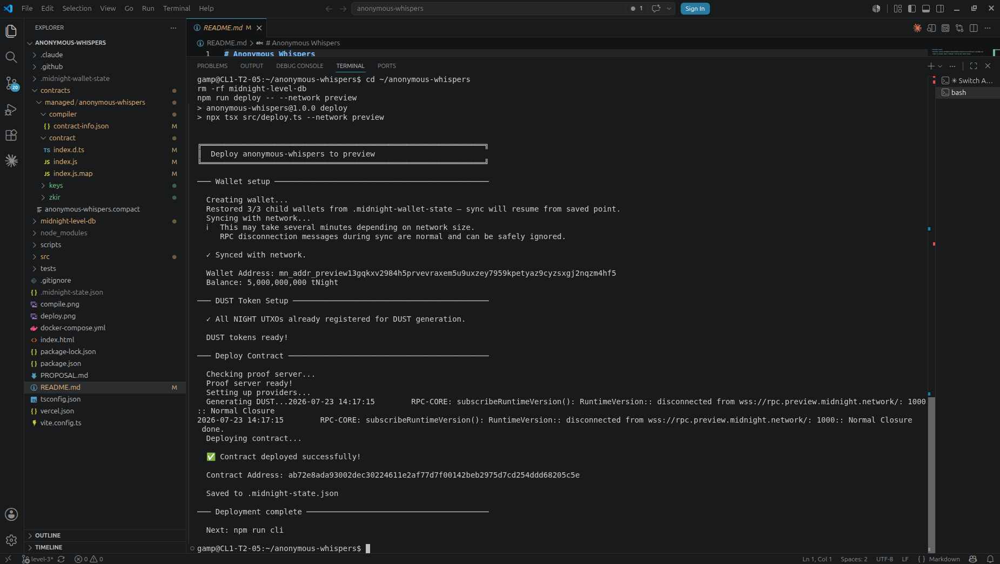
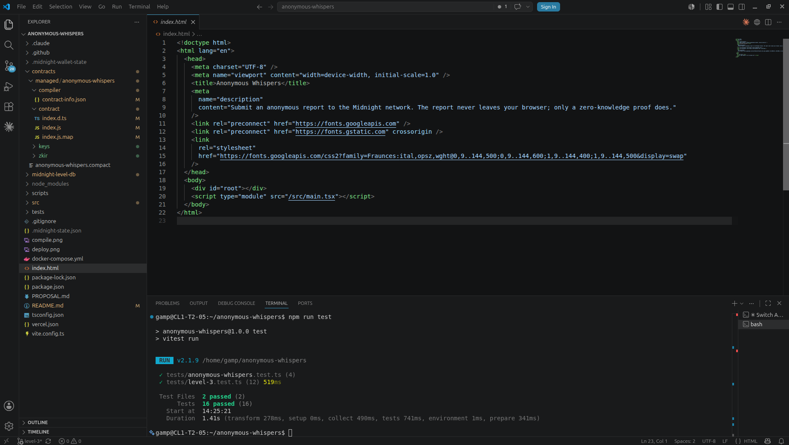

# Anonymous Whispers


> Submit an anonymous report on Midnight. Prove you did. Reveal nothing.

## Live Demo

[https://anonymous-whispers.vercel.app](https://anonymous-whispers.vercel.app)

## Contract Address

| Network | Level | Address |
|---------|-------|---------|
| Preview | 3 | `ab72e8ada93002dec30224611e2af77d7f00142beb2975d7cd254ddd68205c5e` |
| Preview | 1-2 | `5f4f45e862ad11072d41a4aace8589f51248e0766510b431cab44c1825394ff0` |

Both Level 2 and Level 3 use Preview rather than Preprod. During the Level 2
build period Preprod was unavailable, and during the Level 3 build period its
indexer was lagging intermittently; both issues were confirmed by the Midnight
team. Preview remained healthy throughout, so all deployments target Preview.

## New in Level 3

Level 3 turns the one-way privacy primitive into a two-way encrypted reporting
system with two roles:

- An organization opens `/inbox`, generates a curve25519 keypair in the
  browser, and registers the public key on-chain via the `register_recipient`
  circuit. The secret key never leaves their machine.
- A reporter opens `/report`, writes a report, and the app encrypts it in the
  browser to the registered public key (nacl.box with a fresh ephemeral sender
  key per submission, so not even the recipient can correlate senders). The
  sealed 512-byte envelope is published on-chain via `submit_encrypted_report`
  together with its SHA-256 hash as an auditable commitment.
- Back in `/inbox`, the organization decrypts every submission locally with
  their secret key. Nobody else, including us and including Midnight, can read
  a single byte.

The Level 1/2 `submit_report` circuit is preserved unchanged for backward
compatibility.

## What This Does

Anonymous Whispers is a whistleblowing dApp with two clearly separated views.

Reporters (`/report`): write a report, and the app encrypts it client-side to
the organization's registered public key before anything else happens. A
zero-knowledge proof is generated in the user's Lace wallet, and the wallet
balances, signs, and submits the transaction. What lands on-chain is a sealed
envelope that is indistinguishable from random bytes without the recipient's
key, plus the envelope's SHA-256 hash and a public counter.

Organizations (`/inbox`): generate and register a recipient keypair, then read
submissions. Decryption happens entirely in the browser with the locally held
secret key.

The plaintext report never leaves the reporter's browser. It is dropped from
memory the moment proving begins, and there is no code path that could
transmit, store, or log it in readable form.

## Privacy Model

What is PUBLIC:

- The counter of total reports submitted.
- The recipient's public key and its version number.
- Each encrypted 512-byte envelope (unreadable without the recipient's key).
- The SHA-256 hash of each envelope (auditable commitment).
- The wallet address that signed, visible to anyone inspecting the transaction
  on-chain.

What is PRIVATE:

- The report content, always. It exists in plaintext only in the reporter's
  browser before encryption and in the recipient's browser after decryption.
- The recipient's private key: PRIVATE, held only by the recipient
  client-side. Never transmitted, never part of any transaction, never seen by
  any server.

What the reporter PROVES without revealing:

- That they submitted a well-formed envelope whose published hash matches.
  This proves a report exists without revealing what it says or who sent it.

## Privacy Claim

An on-chain observer sees that a report was submitted and can fetch the
ciphertext, but cannot recover the content. The recipient can read the content
but cannot identify the sender: every envelope is encrypted under a fresh
ephemeral key that is destroyed after use. The only way for content to become
known is if the recipient or submitter chooses to share it.

## Vision and Roadmap

Phase 1 (shipped in Level 2): the privacy primitive. A submitter proves they
submitted content matching a published SHA-256 hash without revealing the
content.

Phase 2 (shipped in Level 3): the two-way encrypted flow. On-chain recipient
key registration, client-side nacl.box encryption to that key, a public
ciphertext inbox, and client-side decryption for the recipient.

Phase 3+ (Mainnet concerns, see PROPOSAL.md): access control on recipient
registration, key rotation with retained history, inbox pagination, spam
economics and rate limiting, and multi-recipient threshold decryption for
boards rather than individuals.

## Product Proposal

The full product proposal, including the data disclosure model and Mainnet
feasibility analysis, is in [PROPOSAL.md](./PROPOSAL.md).

## Tech Stack

- Midnight Network (Preview)
- Compact language
- Midnight.js SDK 4.1.x
- tweetnacl (curve25519-xsalsa20-poly1305)
- React 19 + react-router-dom
- Vite 8
- TypeScript
- Tailwind CSS
- Lace wallet extension

## Prerequisites

- Lace wallet browser extension installed and set to the Preview network
- Preview tNIGHT balance funded from
  [https://midnight-tmnight-preview.nethermind.dev](https://midnight-tmnight-preview.nethermind.dev)
- Preview tDUST auto-generates from tNIGHT (allow a few minutes after funding)
- For local development: Node.js v22+, npm

## Run Locally

```bash
git clone https://github.com/Emmanuellsensai/anonymous-whispers.git
cd anonymous-whispers
npm install --legacy-peer-deps
npm run dev
```

Then open http://localhost:5173. The landing page offers both entry points:

- `/report` is the reporter view: submit an encrypted report.
- `/inbox` is the organization view: register as recipient and read
  decrypted submissions.

Connect Lace (Preview) on either view to transact. The frontend needs no proof
server and no Docker: proving happens inside the Lace wallet.

## Run Tests

```bash
npm run test
```

Covers the compiled Compact circuits (submission logic, state transitions, and
a privacy assertion that the witness never reaches the public ledger) plus the
Level 3 encryption layer (round-trip, wrong-key rejection, corrupt-ciphertext
handling, envelope format, and sender unlinkability). The Level 3 circuit
tests activate automatically once `npm run compile` has produced the
three-circuit build; on machines without the Compact toolchain they are
skipped and CI runs them instead.

## CI/CD

Every push to `main` or `level-3` (and every PR to `main`) runs
`.github/workflows/ci.yml`: install, Compact toolchain setup, contract
compile, TypeScript type check, tests, and frontend build. Deployment is
deliberately excluded from CI; it would spend real tDUST and change the live
contract address.

## Demo Video

Watch the Level 2 demo: https://youtu.be/1C2ypyz2Qoc

The video shows the full flow: connecting Lace, submitting an anonymous
report, watching the zero-knowledge proof generate locally, and verifying the
on-chain hash while the report content is never revealed.

## Level 1 (Contract Deployment)

Level 1 (the Compact contract and backend deployment) is complete and
reviewed. The contract source is at `contracts/anonymous-whispers.compact` and
the deployment CLI is at `src/cli.ts` (run with `npm run cli`). The offline
test suite runs with `npm test`, and `npm run deploy -- --network preview`
deploys a fresh instance against a local proof server
(`npm run proof-server:start`).

## Screenshots

Level 3 contract compile (three circuits):



Level 3 deployment to Preview:



Level 3 test suite (circuits plus encryption layer):

